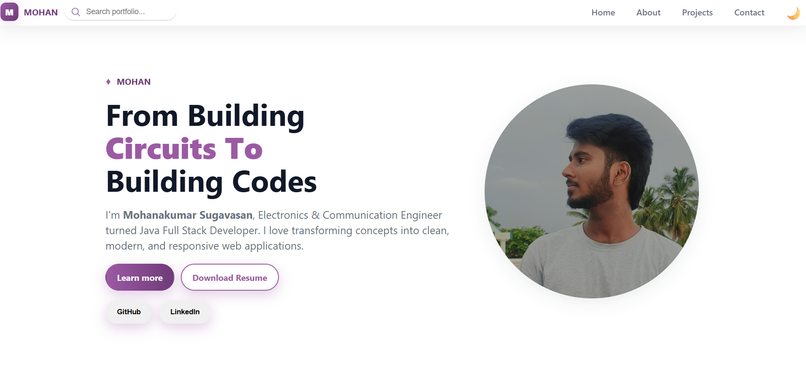
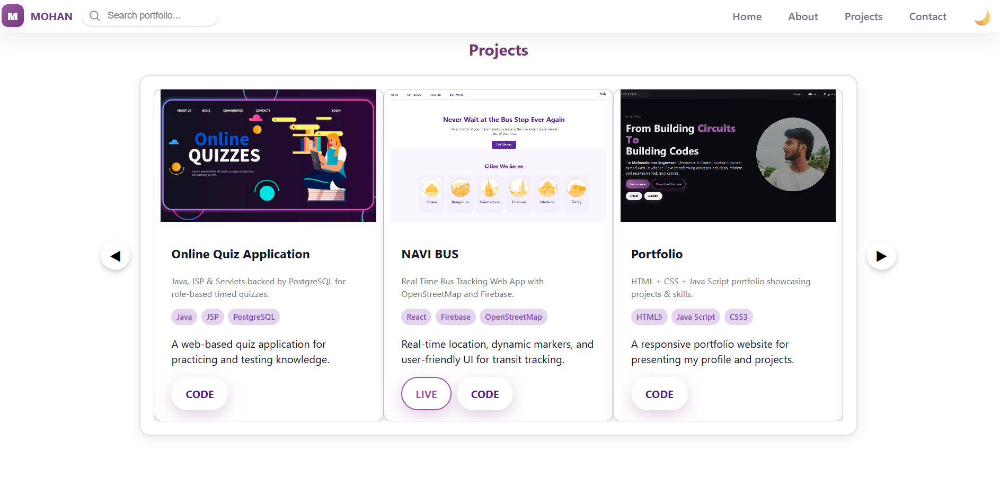

# 🌐 Mohanakumar Sugavasan – Personal Portfolio  

  
  
  

> ⚡ A clean and modern **personal portfolio website** built with **HTML, CSS & JavaScript**, showcasing my journey from **Electronics & Communication Engineer** to **Aspiring Full Stack Developer**.  

---

## 🚀 Live Demo  
🔗 [**View Portfolio**](https://sgmohan18.github.io/Portfolio/)  

---

## ✨ Features  
✅ **Responsive Design** – Perfectly adapts to mobile, tablet & desktop.  
🎨 **Elegant White & Mauve Theme** – Minimal yet professional.  
📂 **Projects Showcase** – Highlighting key works with a smooth carousel.  
📝 **About Me** – Short intro & professional background.  
📬 **Contact Form** – Reach out directly from the site.  
🔍 **Search Functionality** – Quickly jump to sections by keyword.  
🍔 **Hamburger Menu** – Sleek mobile navigation with slide-in effect.  
🌙 **Dark/Light Mode** – Toggle for personalized viewing experience.  

---

## 🛠️ Tech Stack  
- **Frontend:** HTML, CSS, JavaScript  
- **Styling:** Custom CSS (White & Mauve theme, Dark/Light toggle)  
- **Deployment:** Firebase Hosting  
- **Version Control:** Git & GitHub  

---

## 📸 Screenshots  

### 🏠 Landing Page  
  

### 📂 Projects Section  
  

---

## 👨‍💻 Author  

**Mohanakumar Sugavasan**  
💼 Aspiring Java Full Stack Developer  
📧 [Email Me](mailto:sgmohan1820@gmail.com)  
🌐 [LinkedIn](http://www.linkedin.com/in/mohanakumar18)  
🐙 [GitHub](https://github.com/sgMohan18)  

---

## 📌 Setup Instructions  

Clone the repo:  
```bash
git clone https://github.com/sgMohan18/Portfolio.git
cd Portfolio
